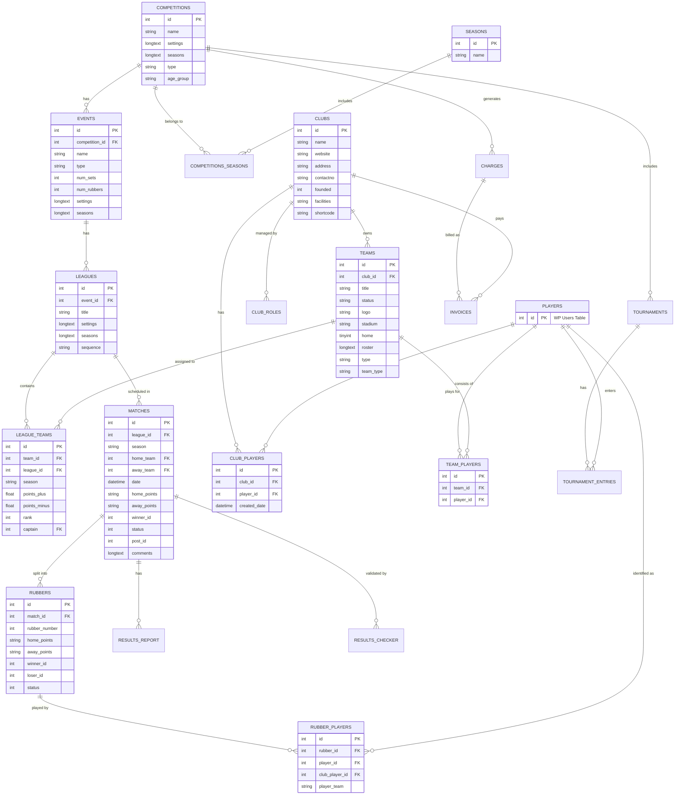

### Database Schematic

The Racketmanager plugin uses a series of custom tables to manage sports leagues, tournaments, clubs, teams, and matches. Below is a Mermaid entity-relationship diagram showing how these tables are linked.

#### Key Relationships and Structure:
*   **Hierarchy**: A `Competition` contains multiple `Events`, which in turn contain `Leagues`. `Leagues` are the containers for `Matches` (fixtures) for a specific season.
*   **Teams and Clubs**: Every `Team` belongs to a `Club`. A `Team` is entered into a `League` via the `league_teams` table, which also tracks league-specific standings (points, rank).
*   **Matches and Rubbers**: A `Match` (Fixture) is composed of multiple `Rubbers` (individual games). The `rubber_players` table tracks which specific players played in which rubber.
*   **Players**: Players are linked to `Clubs` (via `club_players`) and `Teams` (via `team_players`). Most player IDs refer to the standard WordPress `users` table.
*   **Financials**: `Charges` are generated based on `Competitions`, and `Invoices` are issued to `Clubs` or `Players`.
*   **Tournaments**: Independent of the league structure, `Tournaments` are linked to `Competitions` and track individual player `entries`.

Note: In the codebase, the table name for `LEAGUES` is often referenced as `racketmanager` or `racketmanager_leagues` through the `$wpdb` global.
