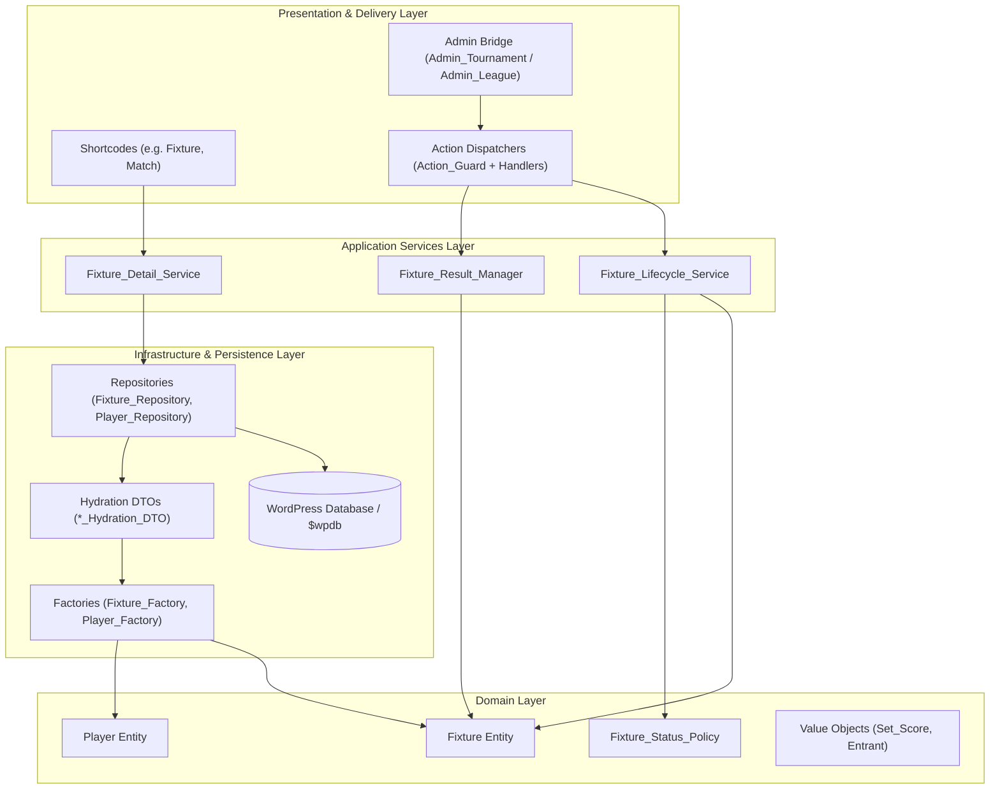

# Domain-Driven Design (DDD) Migration & Architecture Plan

### Overview & Goals
The objective of this plan is to maximize overall system utility, reliability, and long-term maintainability for the RacketManager WordPress plugin. By completing the transition from legacy God Objects (primarily `Racketmanager_Match`) and direct `$wpdb` queries to a modern Domain-Driven Design (DDD) and Hexagonal architecture, this plan minimizes runtime bugs, prevents data corruption during match score submissions, and empowers administrators, players, and developers with a robust, scalable platform.

### Scope
- **In Scope:**
  - Transitioning `Fixture` and `Player` domain models from generic object hydration (`?object $data`) to strictly typed Hydration DTOs and Factories.
  - Migrating remaining CRUD, lifecycle notifications, and persistence logic from `Racketmanager_Match` to `Fixture_Repository`, `Fixture_Lifecycle_Service`, and `Fixture_Result_Manager`.
  - Completing the Admin Controller modernization (Action Dispatcher + Post-Redirect-Get + Flash messaging) for tournament and league admin views.
  - Decoupling public shortcodes and templates from legacy entity properties and routing them through `Fixture_Detail_Service` and View Models.
  - Phased deprecation of `Racketmanager_Match` and legacy global helpers (`get_match()`).
- **Out of Scope:**
  - Full UI redesign of public shortcodes (visual output and shortcode parameters remain backwards-compatible).
  - Destructive database table schema restructuring (existing database tables are preserved while persistence mechanisms are encapsulated).

### User Stories
- **As a Tournament & League Administrator**, I want idempotent match submissions and reliable draw generation so that match rescheduling and score confirmations are processed without duplicate submissions or corrupted records.
- **As a League Player / Team Captain**, I want accurate, fast-loading fixture and league standing views on web and mobile so that I can submit results and verify rankings with total confidence in data integrity.
- **As a System Maintainer / Developer**, I want decoupled, single-responsibility domain entities and services covered by unit tests so that new competition formats can be added with minimal cognitive friction and zero regression risk.

### Functional Requirements
- **Strict Typing & Immutable DTOs:** All domain entities must be hydrated via explicit DTOs (`Fixture_Hydration_DTO`, `Player_Hydration_DTO`) using PHP 8.3 type safety.
- **Repository-Driven Persistence:** No domain entity or controller may directly execute `$wpdb` SQL queries or `get_user_meta` calls; all data access must go through dedicated repositories (`Fixture_Repository`, `Player_Repository`, `Competition_Repository`).
- **Idempotent Admin Mutations:** All admin POST actions must pass through an `Action_Guard_Interface`, delegate to dedicated application services via Action Dispatchers, and follow the Post-Redirect-Get (PRG) pattern with transient flash messaging.
- **Backward-Compatible Public Interfaces:** Legacy helper functions (such as `get_match()`) and existing shortcode entry points must seamlessly route through modern repositories during the deprecation period.

### Non-Functional Requirements
- **Performance & Efficiency:** Reduce memory overhead and unnecessary database queries during batch fixture rendering and standing calculations.
- **Testability:** Domain logic and action dispatchers must be decoupled from the WordPress runtime to enable fast, automated PHPUnit execution.
- **Maintainability:** Eliminate monolithic files exceeding 1,000 lines by decomposing behaviors into single-responsibility services and policies.

---

### Technical Design

#### Current Implementation
The RacketManager plugin is actively progressing through a multi-phase modernization:
- **Reference Blueprints:** `Results_Checker` (uses typed DTOs and presenters), `Set_Score` / `Scoring_Context` (immutable Value Objects), and the modernized `Competition` entity (decoupled via `Competition_Hydration_DTO`, `Competition_Factory`, and `Competition_Repository`).
- **Legacy Bottlenecks:**
  - `Fixture.php` constructor accepts untyped `?object` and manually maps ~40 properties while managing internal state flags.
  - `Player.php` combines data retrieval, database queries, and validation within the domain entity.
  - `Racketmanager_Match.php` (>3,400 lines) still retains residual CRUD methods, lifecycle triggers, and direct `$wpdb` calls.
  - Global procedural helpers in `functions.php` (`get_match()`) instantiate legacy classes directly.

#### Key Decisions
1. **Typed DTO & Factory Hydration Pattern:** Replace generic object injection in `Fixture` and `Player` with dedicated `*_Hydration_DTO` objects and `*_Factory` classes, ensuring deterministic state hydration.
2. **Encapsulated Application & Domain Services:** Extract match orchestration, notifications, and rescheduling out of entities into `Fixture_Lifecycle_Service`, `Fixture_Result_Manager`, and `Fixture_Status_Policy`.
3. **Uniform Admin PRG Architecture:** Standardize all `Admin_Tournament` and `Admin_League` POST actions on the Controller-Service + Action Dispatcher + PRG + Flash message pattern.
4. **Gradual Facade Deprecation:** Route legacy entry points (`get_match()`, `get_rubber()`) to modern repositories as compatibility adapters before final removal, safeguarding external extensions and existing templates.

#### Architecture Diagram

#### Target File Structure & Affected Components
- `src/php/Domain/DTO/Fixture_Hydration_DTO.php` & `Player_Hydration_DTO.php`: Strict database-to-entity mapping contracts.
- `src/php/Domain/Factory/Fixture_Factory.php` & `Player_Factory.php`: Entity instantiation.
- `src/php/Domain/Policy/Fixture_Status_Policy.php`: Encapsulated status and eligibility rules.
- `src/php/Application/Service/Fixture_Lifecycle_Service.php`: Rescheduling, withdrawal, and notification workflows.
- `src/php/Repository/Fixture_Repository.php` & `Player_Repository.php`: Data retrieval and persistence.
- `src/php/Admin/Admin_Tournament.php` & `Admin_League.php`: Refactored to thin route delegates with PRG and flash messages.
- `functions.php`: Modernized `get_match()` wrapper.
- `src/php/Domain/Racketmanager_Match.php`: Marked as `@deprecated`.

#### Risks & Mitigations
- **Risk:** Existing custom templates or plugins relying on dynamic public properties on `Racketmanager_Match`.
  - **Mitigation:** Implement `__get()` compatibility facades or typed View Models (`Fixture_Details_DTO`) with clear accessor parity.
- **Risk:** Incomplete data hydration when loading legacy records with missing metadata.
  - **Mitigation:** Provide robust default values and nullable typing in `Fixture_Hydration_DTO`, logging hydration anomalies gracefully.

---

### Testing & Validation Strategy

#### Validation Approach
Verification focuses on maximizing test throughput and regression prevention by prioritizing isolated unit tests that execute without WordPress runtime overhead, complemented by integration tests for persistence and dispatching.

#### Key Scenarios
1. **Hydration & Factory Verification:**
   - Verify `Fixture_Factory` and `Player_Factory` correctly instantiate entities from valid `*_Hydration_DTO` instances.
   - Assert exceptions or fallback handling when malformed data payloads are supplied.
2. **Lifecycle & Result Management:**
   - Verify `Fixture_Lifecycle_Service::reschedule_fixture()` updates timestamps, adjusts status flags via `Fixture_Status_Policy`, and triggers appropriate notifications.
   - Verify `Fixture_Result_Manager` accurately persists match scores, updates rubber standings, and recalculates league tables without rounding or tiebreak anomalies.
3. **Admin Controller & Dispatcher Parity:**
   - Verify POST requests to `view=match` and `view=matches` trigger the appropriate Action Guard, execute domain updates, and issue a 302 redirect back to the originating context with a flash notice.
   - Verify page refresh following a POST mutation does not re-execute business actions.

#### Edge Cases
- **Special Match Outcomes:** Walkovers (`is_walkover`), retirements (`is_retired`), shared points (`is_shared`), and penalty point deductions.
- **Concurrency & Stale State:** Multiple administrators updating the same tournament draw or match rubber concurrently.
- **Partial Data Imports:** CSV/Excel tournament imports with missing player IDs, unassigned courts, or undefined start times.

---

### Delivery Steps

#### Step 1: Implement Fixture and Player Hydration DTOs and Factories
Ensure domain entities are strictly typed and decoupled from generic database query results to eliminate silent hydration failures and optimize data integrity.
- Create `Fixture_Hydration_DTO` and `Player_Hydration_DTO` to enforce strict type contracts for all persistent fields.
- Implement `Fixture_Factory` and `Player_Factory` to handle domain object instantiation from database rows and WordPress user meta.
- Refactor `Fixture.php` and `Player.php` constructors to consume typed hydration DTOs instead of generic `?object` inputs.
- Extract state-flag calculations out of `Fixture.php` into a dedicated `Fixture_Status_Policy`.

#### Step 2: Migrate Match Persistence and Lifecycle to Domain Services
Decouple match management, rescheduling, and result recording from the legacy God Object into focused application services and repositories.
- Expand `Fixture_Repository` with standardized retrieval and persistence methods (`find_by_id`, `save`, `delete_fixture`).
- Implement `Fixture_Lifecycle_Service` to orchestrate match rescheduling, withdrawal handling, and team notifications (`advance_teams`, `reschedule_fixture`).
- Migrate tiebreak and match result persistence from `Racketmanager_Match::update_result_database()` and `update_result_tie()` into `Fixture_Result_Manager` and `Result_Repository`.
- Refactor `Admin_Import::import_fixtures()` and `League::get_matches()` to use `Fixture_Repository` and `Fixture_Service`.

#### Step 3: Complete Admin Controller Modernization with Action Dispatchers and PRG Pattern
Eliminate duplicate form submissions, ensure idempotent requests, and standardize administrative workflows across tournament management views.
- Standardize redirect URL generation and POST handling for `view=match` and `view=matches` in `Admin_Tournament`.
- Extend the Controller-Service + Action Dispatcher + PRG (Post-Redirect-Get) pattern to remaining views (`view=contact`, `view=teams`, and `view=setup-event`).
- Replace inline validator arrays in admin views with standardized `Error_Bag` implementations.
- Refactor admin view templates to consume consolidated View Models (`$vm`) rather than unpacked global variables.

#### Step 4: Deprecate Legacy Match God Object and Global Helper Callers
Safely retire legacy monolithic classes and entry point helpers, delivering a clean, maintainable architecture across all shortcodes and templates.
- Refactor `Shortcodes_Match.php`, `Shortcodes_Club.php`, and frontend templates to consume `Fixture_Details_DTO` and `Fixture_Detail_Service` rather than `get_match()`.
- Update the global `get_match()` helper in `functions.php` to delegate to `Fixture_Repository::find_by_id()` or mark as `@deprecated`.
- Add `@deprecated` annotations and deprecation log triggers to residual methods in `Racketmanager_Match.php`.
- Remove dead legacy branches from `Admin_Tournament` once parity with new controllers is verified.
