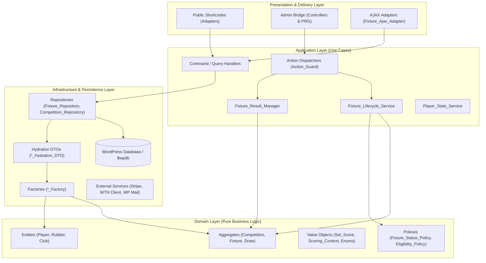

# Requirements

### Overview & Context
The RacketManager WordPress plugin is undergoing an architectural transformation from a legacy WordPress-centric "Active Record / Transaction Script" model into a modern **Domain-Driven Design (DDD)** and **Hexagonal (Ports & Adapters)** architecture. Over multiple iterations, significant progress has been achieved, establishing clean blueprints in specific modules (`Results_Checker`, `Set_Score`, `Competition`). However, legacy God Objects (`Racketmanager_Match`, `Fixture`, `Player`), procedural entry points (`get_match()`, `get_competition()`), and mixed presentation concerns still remain.

This summary synthesizes the findings, audits, and migration roadmaps documented in the plugin's `docs/` repository, defining the **Current State**, the **Desired Future State**, and the **Concrete Steps** to achieve full DDD compliance.

---

### Key Goals & Strategic Objectives
1. **Domain Purity & Encapsulation:** Decouple core domain rules (fixtures, tournaments, scoring, eligibility) from WordPress database globals (`$wpdb`), options (`get_option`), and global helper functions.
2. **Type Safety & Deterministic Hydration:** Enforce strict PHP 8.3 typing, immutable Value Objects, and typed Hydration DTOs across all entities.
3. **Layered Separation of Concerns:** Establish distinct boundaries between Presentation (Shortcodes, Admin, AJAX), Application (Services, Commands, Queries), Domain (Aggregates, Policies, Value Objects), and Infrastructure (Repositories, WPDB, Mailers, Payment Gateways).
4. **Idempotency & Maintainability:** Standardize mutations on the Action Dispatcher + Post-Redirect-Get (PRG) + Flash messaging pattern to eliminate duplicate submissions and state corruption.
5. **Safe Deprecation:** Retire legacy God Objects (`Racketmanager_Match`) and procedural wrappers with zero runtime regression through backward-compatible shims and adapter facades.

---

### Scope Summary
* **In Scope:**
  * Refactoring entity hydration (`Fixture`, `Player`) to typed DTOs and Factories.
  * Moving business logic and persistence out of `Racketmanager_Match` into `Fixture_Repository`, `Fixture_Lifecycle_Service`, and `Fixture_Result_Manager`.
  * Standardizing Admin and AJAX controllers on the Action Dispatcher / PRG / Adapter patterns.
  * Migrating frontend presentation to Presenters and logic-less View Models (`$vm`).
  * Final deprecation and removal of `Racketmanager_Match` and legacy include shims.
* **Out of Scope:**
  * Destructive database schema alterations (existing SQL table structure is maintained).
  * Breaking public shortcode syntax or user-facing URL routing.

# Technical Design

### 1. Current State Assessment

The plugin is in an advanced transitional phase, displaying a hybrid architecture of modernized DDD modules alongside legacy God Objects:

#### A. Modernized Blueprints (DDD Compliant)
* **`Results_Checker` Subsystem:** High compliance. Uses `Results_Checker_Data` DTO for constructor hydration, `Results_Checker_Presenter` for view transformation, and `Results_Checker_View_Model` for logic-less rendering.
* **Scoring Domain (`Set_Score` & `Scoring_Context`):** High compliance. Immutable Value Objects enforcing scoring invariants without database or WordPress coupling.
* **Entrant Polymorphism:** `Entrant` interface with `Player_Entrant` and `Team_Entrant` implementations allowing unified fixture participation handling.
* **Modernized `Competition` Entity:** Decoupled via `Competition_Hydration_DTO`, `Competition_Factory`, `Competition_Repository`, `Competition_Policy`, and `Competition_Type` Enums.
* **Core Autoloading & DI:** Completed PSR-4 autoloading under `src/php/` (Phase E complete), backed by a lightweight `Simple_Container` and `Container_Bootstrap` for lazy dependency injection.
* **Tournament Admin Bridge:** Modernized `view=draw`, `view=match`, `view=matches`, and `view=information` using the Controller-Service + Action Dispatcher + `Action_Guard_Interface` + PRG pattern.
* **Frontend JavaScript:** Modularized event architecture under `src/js/features/` with document-level delegated event handlers (`data-action`).

#### B. Legacy Bottlenecks & Debt
* **`Fixture` Entity:** God Object characteristics. The constructor accepts generic `?object $data`, manually mapping ~40 properties while internally calculating status flags via `set_status_flags()`.
* **`Player` Entity:** Blends domain modeling with persistence and querying (`get_matches()`, `get_stats()`, and validation warnings).
* **`Racketmanager_Match` Class (>3,400 lines):** Legacy God Object holding residual CRUD methods, result persistence (`update_result_database()`, `update_result_tie()`), lifecycle notifications, and direct `$wpdb` calls.
* **Procedural Wrappers:** Global functions like `get_match()` and residual calls to `get_competition()` create hidden service-locator dependencies.
* **Presentation Coupling:** Residual admin templates and AJAX handlers still perform inline date formatting (`mysql2date`), URL construction, or direct entity manipulation.

---

### 2. Desired Future State (Target Architecture)

The target architecture is a **Domain-Driven, Hexagonal (Ports & Adapters) Architecture** partitioned into explicit **Bounded Contexts**:

#### Defined Bounded Contexts
1. **Tournament & League Configuration Context:** Manages tournament definitions, rules, grades, phases (Open, In Progress, Closed), and season lifecycle.
2. **Registration & Eligibility Context:** Manages participant entry lifecycles, partner requests/confirmations, seedings, and eligibility policies.
3. **Draw & Scheduling Context:** Manages brackets (knockout, round-robin), court schedules, rounds, progression, and byes.
4. **Contest & Scoring Context:** Manages fixtures, rubbers, set scores, result submissions, tiebreak verifications, and league standings recalculations.
5. **Finance Context:** Manages tournament entry fee calculations, payments, Stripe transactions, and invoicing decoupled via domain events.
6. **Club & Membership Context:** Manages club profiles, roles, venues, and member rosters.

---

### 3. Layered Architectural Standards

| Layer | Responsibility | Allowed Dependencies | Prohibited Dependencies |
| :--- | :--- | :--- | :--- |
| **Domain** | Aggregates, Entities, Value Objects, Domain Policies | Pure PHP only; standard libraries, Domain VOs | No `$wpdb`, no WordPress globals, no Repositories, no HTTP state |
| **Application** | Services, Command/Query Handlers, DTOs, Use Case Orchestration | Domain Layer, Repository Interfaces, Service Contracts | No raw HTML rendering, no direct `$_POST`/`$_GET` access |
| **Infrastructure** | Repositories, Hydrators, DB Adapters, External Clients | Application interfaces, WordPress APIs (`$wpdb`, `get_user_meta`) | No domain business rule calculations |
| **Presentation** | Shortcodes, Admin Bridges, AJAX Adapters, Presenters, View Models | Application Services, Presenters, View Models | No direct `$wpdb` access, no domain logic inside `.php` templates |

---

### 4. Key Architectural Decisions
* **DTO-Factory Hydration:** Repositories query persistence and build `*_Hydration_DTO` instances. `*_Factory` classes consume DTOs to instantiate Domain Entities with strict type enforcement.
* **Thin Admin Controllers & PRG:** Admin controllers validate nonces, invoke Action Dispatchers via `Action_Guard_Interface`, store transient flash messages, and execute Post-Redirect-Get redirects to prevent form re-submission.
* **Separation of Scheduled Encounter from On-Court Unit:** The domain cleanly separates `Fixture` (the scheduled contest between two entrants) from `Rubber` / `ContestUnit` (the actual on-court match unit played by individuals/pairs).
* **Presenter & View Model Decoupling:** Presenters translate Domain DTOs into immutable, pre-formatted View Models (`$vm`). Templates contain pure HTML markup without date formatting or query helpers.

# Testing

### Validation & Quality Strategy
The DDD migration strategy relies on maximizing automated test coverage through fast, isolated unit tests decoupled from the WordPress runtime, complemented by targeted integration tests.

---

### Key Verification Scenarios

#### 1. Domain & Hydration Invariants
* **Strict Hydration:** Validate that `Fixture_Factory` and `Player_Factory` successfully hydrate entities from typed `*_Hydration_DTO` objects and throw domain exceptions on malformed payloads.
* **Immutability of Value Objects:** Confirm `Set_Score` and `Scoring_Context` prevent invalid score mutations and handle walkovers, retirements, and tiebreaks deterministically.
* **Status Policy Resolution:** Test `Fixture_Status_Policy` against all fixture states (scheduled, overdue, confirmed, pending, disputed, walkover).

#### 2. Application Workflows & Idempotency
* **Result Submission & Standings:** Execute `Fixture_Result_Manager` across singles, doubles, and rubber-based team fixtures, confirming accurate table standing recalculations and rubber point distribution.
* **Lifecycle Transitions:** Verify `Fixture_Lifecycle_Service::reschedule_fixture()` updates timestamps and dispatches notifications without mutating unrelated match metadata.
* **Admin PRG Execution:** Assert that POST actions to `Admin_Tournament` and `Admin_League` execute through Action Guards, dispatch domain commands, and return 302 redirects with transient flash notices.

#### 3. Presentation Parity
* **Logic-less Template Rendering:** Confirm view templates render using only `$vm` properties without triggering runtime warnings or global state lookups.
* **Shortcode & AJAX Parity:** Ensure `[fixture]` and `[match]` shortcodes via `Fixture_Shortcode_Adapter` and AJAX calls via `Fixture_Ajax_Adapter` produce identical UI output to legacy endpoints.

---

### Automated & Smoke Testing Checklist
* **PHPUnit Suite:** Ensure all existing unit tests (430+ tests) remain green with zero regressions.
* **Autoloading Verification:** Ensure `composer dump-autoload -o` runs cleanly with no missing class dependencies.
* **Public Feature Smoke Tests:**
  * Match options modal (reschedule, switch home/away, reset result).
  * Singles score entry and team rubber result updates.
  * Tournament entry checkout, partner selection modal, and withdrawal workflows.
  * Player profile search and statistics filtering.

# Delivery Steps

###   Step 1: Stage 1: Domain Entity & Hydration DTO Refactoring
Complete the elimination of untyped generic object hydration across core entities and decouple state rules from data structures.

- Define `Fixture_Hydration_DTO` and `Player_Hydration_DTO` enforcing strict PHP 8.3 type contracts for persistent fields.
- Implement `Fixture_Factory` and `Player_Factory` to encapsulate entity instantiation from database rows and metadata.
- Refactor `Fixture` and `Player` constructors to consume hydration DTOs instead of `?object $data`.
- Extract internal state-flag and scheduling calculations from `Fixture` into `Fixture_Status_Policy`.
- Extract query and career aggregation methods (`get_matches`, `get_stats`) from `Player` into `Player_Stats_Service` and `Player_Query_Service`.

###   Step 2: Stage 2: Match Persistence and Lifecycle Service Migration
Migrate all remaining persistence, lifecycle workflows, and result operations away from the monolithic match class into dedicated repositories and domain services.

- Expand `Fixture_Repository` to handle all fixture CRUD operations (`find_by_id`, `save`, `delete_fixture`, `find_one_by_slug_criteria`).
- Implement `Fixture_Lifecycle_Service` to orchestrate match rescheduling, withdrawals, and knockout advancement notifications (`reschedule_fixture`, `advance_teams`, `handle_withdrawal`).
- Migrate tiebreak and match result persistence (`update_result_tie`, `update_result_database`) into `Fixture_Result_Manager` and `Result_Repository`.
- Refactor `Admin_Import::import_fixtures()` and `League::get_matches()` to consume `Fixture_Repository` and `Fixture_Service`.

###   Step 3: Stage 3: Admin & AJAX Controller Architecture Uniformity
Standardize administrative and asynchronous mutation workflows on the Action Dispatcher, Guard, and Post-Redirect-Get (PRG) patterns.

- Extend the Controller-Service + Action Dispatcher + PRG pattern to remaining tournament and league admin views (`view=contact`, `view=teams`, `view=setup-event`).
- Standardize redirect URL generation and integrate `Error_Bag` validation across admin views.
- Refactor `Ajax_Fixture` endpoints into `Fixture_Ajax_Adapter` using command DTOs (`Update_Fixture_Command`, `Reschedule_Command`) and explicit composition with `Security_Service`.
- Register all newly extracted controllers and adapters in `Container_Bootstrap` via `Simple_Container`.

###   Step 4: Stage 4: Presentation Layer Decoupling & View Models
Eliminate direct model dependencies from UI templates and shortcodes by introducing dedicated query handlers, presenters, and view models.

- Refactor `Shortcodes_Match.php` and `Shortcodes_Club.php` to resolve data through `Fixture_Detail_Service` rather than legacy helper calls.
- Decompose monolithic presenters into focused UI formatters (`Fixture_Status_Presenter`, `Fixture_Header_Presenter`, `Club_Presenter`).
- Enforce logic-less templates by ensuring all view files consume typed View Models (`$vm`) without direct calls to `mysql2date`, `$wpdb`, or global state.
- Complete frontend JavaScript Phase 10 cleanup by ensuring all user interactions route through delegated event handlers (`data-action`).

###   Step 5: Stage 5: Legacy God Object Deprecation & System Consolidation
Safely decommission legacy god objects, procedural entry points, and temporary backward-compatibility shims.

- Update `functions.php` global helpers (`get_match()`, `get_competition()`) to trigger `E_USER_DEPRECATED` notices and delegate to modern service repositories.
- Remove remaining legacy execution branches in `Admin_Tournament` and `Admin_League`.
- Annotate remaining methods in `Racketmanager_Match.php` as `@deprecated` and transition remaining external callers.
- Safely remove `Racketmanager_Match.php` and prune legacy file shims under `include/` from Composer autoloading.
